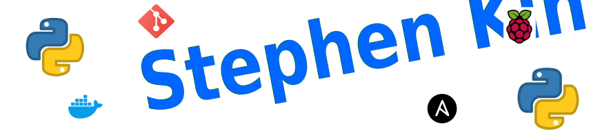

<base target="_blank">

# Hi there 👋

I am a classically & conventionally trained scientist with BSc. and MSc. degrees in Biochemistry and Chemistry. I was at one time a medical researcher but sadly decided there was no future in pure science. I bagan my I.T. career as a Cisco qualified network support and design engineer (at BT and other Telcos and ISP's), QA Automation, DevOps automation and now finally, a fully committed Software Engineer (Primarily Python).

## 🛠️ Technologies & Tools

### A bit more...

- Being somewhat of an inventor, I love finding new and innovative ways to use the 
Raspberry Pi and other [SBC's][sbc_tt].  I marvel at the way sensors and actuators bring another dimension to my Python creations.
- As a keen member of the maker community I utilize many flavours of [SBC's][sbc_tt] and microcontrollers in my [IoT][iot_tt] projects including Arduino, PyBoard, ESP8266, ESP32 etc.
with languages like [**MicroPython**](https://micropython.org/), [**CircuitPython**](https://circuitpython.org/) and C.
- I enjoy electronics; designing [PCB's][pcb_tt], soldering, fixing, reverse engineering etc. Recently saved myself a fortune by repairing two 'dead' Synology [NAS][nas_tt] drives. The component
failures were identified by 'hacking' the firmware.  These drives would have been destined for the scrap pile.
- Sadly, life if short. So automation is the key. I try to automate as much as possible (at work and home). For example, a recent endeavour to source a Sony PS5 was proving fruitless. However, with the aid of web scraping
  (utilising [**Selenium**][selenium_url], [**OpenCV**][opencv_url], [**Beautiful Soup**][beautiful_soup_url] and [**Scrapy**][scrapy_url]) I was able to snag one within days.  I know this is an abuse of my Python powers...I'm keeping this one in my private repository for obvious reasons.
- When I'm not coding, inventing, soldering and welding I can usually be found golfing. It's surprising how cathartic whacking a little ball with a stick can be.

####   Thanks for reading 

## 📈 GitHub Stats

## 🔥 Streak Stats

## 💻 Some of my projects
Look on my works, ye Mighty, and despair! (or laugh :laughing: or cry :sob:...)

  

  

  

 

## 📈 Last 30 Day contributions

## 📈 Yearly contributions

<!-- Markdown link & img dfn's -->
[sbc_tt]: ## "Single Board Computer"
[pcb_tt]: ## "Printed Circuit Board"
[iot_tt]: ## "Internet of Things"
[nas_tt]: ## "Network Attached Storage"
[beautiful_soup_url]: https://www.crummy.com/software/BeautifulSoup/
[scrapy_url]: https://github.com/scrapy/scrapy
[selenium_url]: https://github.com/SeleniumHQ/selenium
[opencv_url]: https://github.com/opencv/opencv

<!-- Resources -->
<!-- Icons: https://simpleicons.org/ -->
<!-- GitHub Stats: https://github.com/anuraghazra/github-readme-stats -->
<!-- Emojis: https://emojipedia.org/emoji/ -->
<!-- HTML Emojis: https://www.fileformat.info/index.htm -->
<!-- Shields: https://shields.io/ -->
<!-- Awesome GitHub Profile README: https://github.com/abhisheknaiidu/awesome-github-profile-readme -->

<!--
**Stephen-RA-King/Stephen-RA-King** is a ✨ _special_ ✨ repository because its `README.md` (this file) appears on your GitHub profile.

Here are some ideas to get you started:

- 🔭 I’m currently working on ...
- 🌱 I’m currently learning ...
- 💬 Ask me about ...
- 📫 How to reach me: ...
- ⚡ Fun fact: ...
-->
