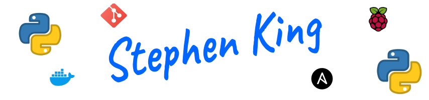

<base target="_blank">

<!--suppress HtmlDeprecatedAttribute -->

# Hey There! 👋

Scientist turned network engineer turned developer — my career has taken the scenic route. Armed with BSc. and MSc. 
degrees in Biochemistry and Chemistry, I once called medical research home before deciding pure science wasn't my final
destination. Cisco networking kicked off my I.T. chapter at BT and beyond, spanning network design, network protocol analysis and validation,
QA Automation and DevOps — until Python got its hooks into me. These days I'm a fully committed Software Engineer, and the lab coat is
firmly retired.

## 🛠️ Technologies & Tools

### A bit more...

- Being somewhat of an inventor, I love finding new and innovative ways to use the 
Raspberry Pi and other [SBC's][sbc_tt].  I marvel at the way sensors and actuators bring another dimension to my Python creations.
- As a keen member of the maker community I utilise many flavours of [SBC's][sbc_tt] and microcontrollers in my [IoT][iot_tt] projects including Arduino, PyBoard, ESP8266, ESP32 etc.
with languages like [**MicroPython**](https://micropython.org/), [**CircuitPython**](https://circuitpython.org/) and C.
- I enjoy electronics; designing [PCB's][pcb_tt], soldering, fixing, reverse engineering etc. Recently saved myself a fortune by repairing two 'dead' Synology [NAS][nas_tt] drives. The component
failures were identified by 'hacking' the firmware.  These drives would have been destined for the scrap pile.
- Sadly, life is short. So automation is the key. I try to automate as much as possible (at work and home). When 
securing tickets to a sold-out show felt like an Olympic sport, I put my Python powers to work — combining web scraping
(utilising [Selenium][selenium_url], [OpenCV][opencv_url], [Beautiful Soup][beautiful_soup_url] and 
[Scrapy][scrapy_url]) to monitor drops and beat the bots at their own game. Ethically questionable? Perhaps. Effective?
Absolutely. This one lives quietly in a private repository.
- When I'm not coding, inventing, soldering and welding I can usually be found golfing. It's surprising how cathartic 
whacking a little ball with a stick can be.

####   Thanks for reading 

## 📈 GitHub Stats

## 🔥 Streak Stats

## 💻 Some of my projects
Look on my works, ye Mighty, and despair! (or laugh :laughing: or cry :sob:...)

 

## 📈 Last 30-Day contributions

## 📈 Yearly contributions

<!-- Markdown link & img dfn's -->
[sbc_tt]: ## "Single Board Computer"
[pcb_tt]: ## "Printed Circuit Board"
[iot_tt]: ## "Internet of Things"
[nas_tt]: ## "Network Attached Storage"
[beautiful_soup_url]: https://www.crummy.com/software/BeautifulSoup/
[scrapy_url]: https://github.com/scrapy/scrapy
[selenium_url]: https://github.com/SeleniumHQ/selenium
[opencv_url]: https://github.com/opencv/opencv

<!-- Resources -->
<!-- Icons: https://simpleicons.org/ -->
<!-- GitHub Stats: https://github.com/anuraghazra/github-readme-stats -->
<!-- Emojis: https://emojipedia.org/emoji/ -->
<!-- HTML Emojis: https://www.fileformat.info/index.htm -->
<!-- Shields: https://shields.io/ -->
<!-- Awesome GitHub Profile README: https://github.com/abhisheknaiidu/awesome-github-profile-readme -->

<!--
**Stephen-RA-King/Stephen-RA-King** is a ✨ _special_ ✨ repository because its `README.md` (this file) appears on your GitHub profile.

Here are some ideas to get you started:

- 🔭 I’m currently working on ...
- 🌱 I’m currently learning ...
- 💬 Ask me about ...
- 📫 How to reach me: ...
- ⚡ Fun fact: ...
-->
