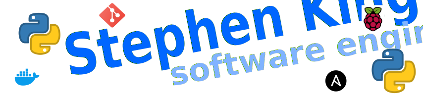

# Hi there 👋

My name is Stephen King (no not that one!).  I am a classically trained scientist with BSc. and MSc. degrees in Biochemistry and Chemistry. I was at one time a medical researcher but sadly decided there was no future in pure science. My first foray into commercial I.T. was when I was at University. To earn some extra funding I took a temporary summer role converting games from the [Spectrum](https://en.wikipedia.org/wiki/ZX_Spectrum) onto the [Commodore 64](https://en.wikipedia.org/wiki/Commodore_64) using 6502 assembly language (yes, I'm that old!).  My I.T. career continued as a Cisco qualified network support and design engineer, QA Automation, DevOps automation and finally now a fully committed Software Engineer (Primarily Python).

## &#128295; Technologies & Tools

### A bit more...

- Being somewhat of an inventor, I love finding new and innovative ways to use the 
Raspberry Pi and other SBC's.  I marvel at the way sensors and actuators bring another dimension to my Python creations.
- As a keen member of the maker community I utilize many flavours of SBC's and microcontrollers in my IOT projects including Arduino, PyBoard, ESP8266, ESP32 etc.
with languages like [MicroPython](https://micropython.org/), [CircuitPython](https://circuitpython.org/) and C.
- I enjoy electronics; designing PCB's, fixing, reverse engineering etc. Recently saved myself a fortune by repairing two 'dead' Synology NAS drives. The component
failures were identified by 'hacking' the firmware.  These drives would have been destined for the scrap pile.
- Sadly, life if short. So automation is the key. I try to automate as much as possible (at work and home). For example, a recent endevour to source a Sony PS5 was proving fruitless. However, with the aid of web scraping
  (utilising Selenium, OpenCV, Beautiful Soup and Scrapy) I was able to snag one within days.  I know this is an abuse of my Python powers...I'm keeping this one in my private repository for obvious reasons.

## &#x1f4c8; GitHub Stats

  

 

  

<!-- Resources -->
<!-- Icons: https://simpleicons.org/ -->
<!-- GitHub Stats: https://github.com/anuraghazra/github-readme-stats -->
<!-- Emojis: https://emojipedia.org/emoji/ -->
<!-- HTML Emojis: https://www.fileformat.info/index.htm -->
<!-- Shields: https://shields.io/ -->
<!-- Awesome GitHub Profile README: https://github.com/abhisheknaiidu/awesome-github-profile-readme -->

<!--
**Stephen-RA-King/Stephen-RA-King** is a ✨ _special_ ✨ repository because its `README.md` (this file) appears on your GitHub profile.

Here are some ideas to get you started:

- 🔭 I’m currently working on ...
- 🌱 I’m currently learning ...
- 💬 Ask me about ...
- 📫 How to reach me: ...
- ⚡ Fun fact: ...
-->
